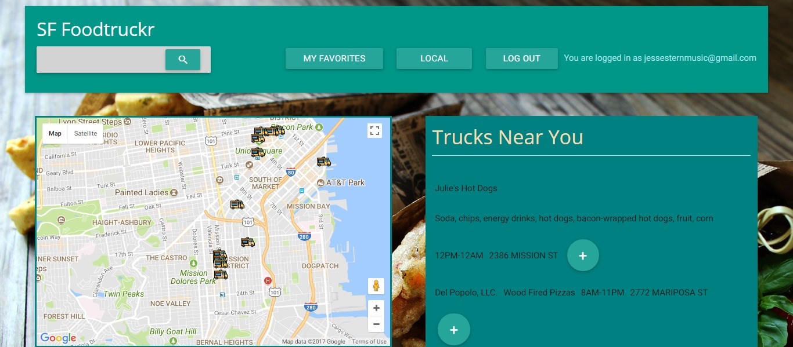

# SF Food Trucker

A web based app that will show the location of Food trucks in San Francisco. The app searches a publically availble City of San Francisco data set which is referenced below (under ## APIS & DATA CONNECTION).  SF Food Trucker is an open source application available free of use.  

## Examples

**Food Truck View**

**Saved Trucks View**

## Built With

* JQuery
* Materialize
* Firebase
* Moment.JS

## APIS & DATA CONNECTIONS

* DataSF - https://data.sfgov.org/Economy-and-Community/Mobile-Food-Schedule/jjew-r69b 
* Google Maps - https://developers.google.com/maps/

## Developers

* **Jarrod Costopulos** 
* **Jesse Stern** 
* **Carlos Lopez** 

## Licences & Legal

~ Licenced under the MIT open source standard as follows ~

Copyright 2017, The Authors named above. 
Permission is hereby granted, free of charge, to any person obtaining a copy of this software and associated documentation files (the "Software"), to deal in the Software without restriction, including without limitation the rights to use, copy, modify, merge, publish, distribute, sublicense, and/or sell copies of the Software, and to permit persons to whom the Software is furnished to do so, subject to the following conditions:

The above copyright notice and this permission notice shall be included in all copies or substantial portions of the Software.

THE SOFTWARE IS PROVIDED "AS IS", WITHOUT WARRANTY OF ANY KIND, EXPRESS OR IMPLIED, INCLUDING BUT NOT LIMITED TO THE WARRANTIES OF MERCHANTABILITY, FITNESS FOR A PARTICULAR PURPOSE AND NONINFRINGEMENT. IN NO EVENT SHALL THE AUTHORS OR COPYRIGHT HOLDERS BE LIABLE FOR ANY CLAIM, DAMAGES OR OTHER LIABILITY, WHETHER IN AN ACTION OF CONTRACT, TORT OR OTHERWISE, ARISING FROM, OUT OF OR IN CONNECTION WITH THE SOFTWARE OR THE USE OR OTHER DEALINGS IN THE SOFTWARE.
